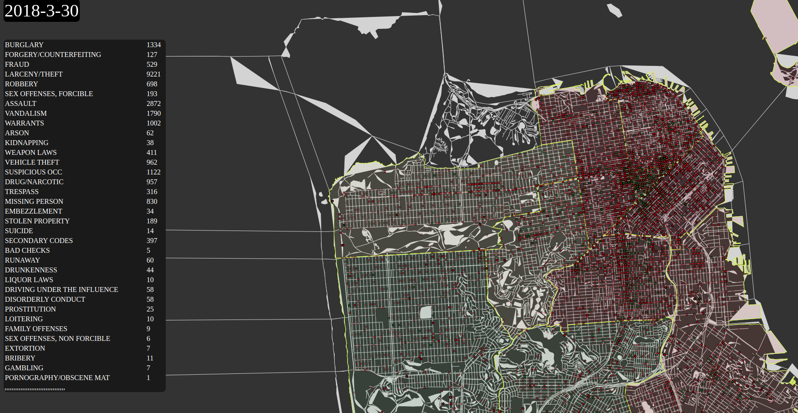

# D3 SF

Check out the [Live Site][1]



Purpose:

Combining data from different sources to create a visualization.

# Technology

+ JavaScript
+ D3js V4

# Background and Challenges

1. Recognizing the technical and syntatical differences of d3 version as many examples in the wild switch between v3 and v4.
2. [Displaying Geographic Data with D3][8] requires understanding of the standard in representing geographical features with [GeoJSON][10].
3. Understanding [Shapes][11] files, the geospatial vector data format for GIS and requirements for [converting][3] them into usable GeoJSON
4. Setting up d3 _projection_ so the map will correctly represent lat/lng in pixels
5. Overlaying different representations of the same map.
6. Taking a large dataset and accurately plotting them on the map.

First we load our datasets using the `queue()` function that will defer further execution until all data is ready.

```js
      d3.queue()
        .defer(d3.json, "data/euSfGeo.json")
        .defer(d3.json, "data/PoliceDistricts.json")
        .defer(d3.csv, "data/2018pdi.csv")
        .await((err, mapData, pdData, dotData) => {
    //..
```

Setup projection for the sf map and bind it to an svg element.

```js
function initMap() {
  var lng = -122.434469;
  var lat = 37.774313;
  var scale = 400000;
  var center = [lng, lat];
  var width = window.innerWidth / 2;
  var height = window.innerHeight / 2;
//..
  const svg = d3
    .select("body")
    .append("div")
    .attr("class","mapcanvas")
    .append("svg")
    .attr("id", "sfmap")
    .attr("width", "100%")
    .attr("height", "1100px")
    .style("z-index", "-1")

    const myProjection = d3
    .geoMercator()
    .center(center)
    .scale(scale)
    .translate([width, height]);

  const path = d3.geoPath().projection(myProjection);
```

Drawing the map requires iterating over the features properties of geojson and appending path data.

```js
function drawMap(err, geojson, path) {
  if (err) throw err;

  d3.select("#sfmap")
    .append("g")
    .selectAll("path")
    .data(geojson.features)
    .enter()
    .append("path")
    .attr("class", "sfmappath")
    .attr("d", path);
}
```

## Animation

Simple stepper function that calls `plotDots` at an interval. 

```js
var stepper = setInterval(
  (function() {
    var date = new Date("1-1-2018"),
      endDate = new Date("3-30-2018");
    return function() {
      year = timelineStep(new Date(date.setDate(date.getDate() + 1)), endDate);
    };
  })(),
  50
);

//..

function timelineStep(date, endDate) {
  requestAnimationFrame(function() {
    d3.select("#currentTime").html(util.formatDate(date));
    plotDots(err, dotData, sfMap.projection, util.formatDate(date));
  });

  if (date >= endDate) {
    clearInterval(stepper);
  }

  return endDate;
}
```

Future Plans:

Create a Pivot Table like interfacte to give users the ability to slice and visualize data better.

Sources:

- [San Francisco City Shape Files][2]
- [GeoJson Converter][3]
- [SFPD by District GeoJson][4]
- [pivot/rollup in d3][5]
- [SFPD Historical Incident Report][6]
- [choropleth coloring][7]
- [Displaying Geographic Data with D3][8]

[1]: http://d3sf.herokuapp.com
[2]: https://www.census.gov/cgi-bin/geo/shapefiles/index.php?year=2018&layergroup=All+Lines
[3]: https://www.statsilk.com/maps/convert-esri-shapefile-map-geojson-format
[4]: https://data.sfgov.org/Public-Safety/Historical-Police-Districts/embj-38bg
[5]: http://learnjsdata.com/group_data.html
[6]: https://www.kaggle.com/san-francisco/sf-police-calls-for-service-and-incidents/version/61
[7]: http://colorbrewer2.org/#type=diverging&scheme=RdYlGn&n=9
[8]: https://www.d3indepth.com/geographic/
[9]: https://www.theguardian.com/environment/interactive/2013/may/14/alaska-villages-frontline-global-warming
[10]: https://en.wikipedia.org/wiki/GeoJSON
[11]: https://en.wikipedia.org/wiki/Shapefile
